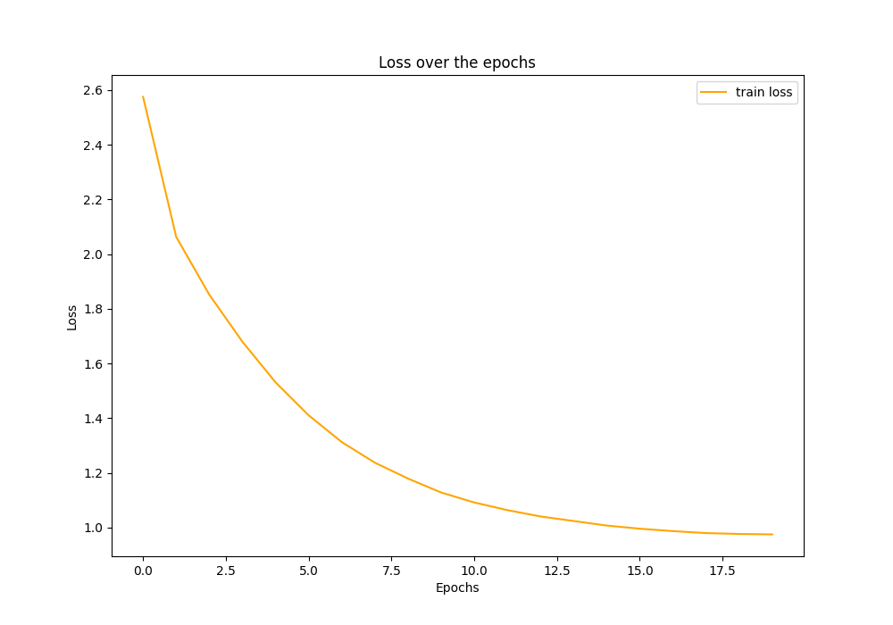

# ImageCaptioning_pytorch


# Steps:
## Clone git repository
```sh
git clone https://github.com/z0CoolCS/ImageCaptioning_pytorch.git
cd ImageCaptioning_pytorch
```

## Create workspace
```sh
mkdir -p data/img/train
mkdir -p data/img/val
mkdir -p checkpts
```

## Download JSON and JPG files
```sh
python -m download_data
```
## Train the Image Caption Model
```sh
python -m main
```

## Predict with trained model
```sh
python -m predict
```

## Results
